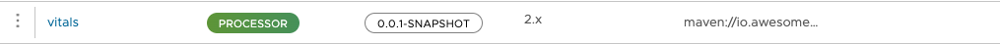

# Patient Vitals Monitoring System
This is a test application that takes a JSON structure of patient vitals and stores them in a database.  The ingest is over HTTP and can allow for numerous sinks, PostGreSQL or MongoDB.  The application is written in Spring and Java.

## Build & Deploy to SCDF

### Build the application
Build a deployable jar file and install to your ~/.m2 repository
```shell
./mvnw clean install
```
### Register the Vitals application, "processor", with SCDF
```shell
dataflow:>app register --name vitals --type processor --uri maven://io.awesome.stuff:Vitals:0.0.1-SNAPSHOT
Successfully registered application 'processor:vitals```
```


### Create the Stream
In the stream view, paste the following stream definition and click "Create Stream".  It will remain in an undeployed state, reference next step.
```shell
http | vitals | log
```
### Deploy the stream
To deploy the stream, click on the stream `vitals`.  At the top, is the "Deploy Stream" button.  Click the button and the "Deploy stream vitals" screen will appear.

Under http source, we will set the "Application Properties" to change the default listener port.  Click the "Edit" button under "Application Properties" and set the "server.port" to 20120.  Click "Update".

The stream can now be deployed by clicking the "Deploy the Stream" button.

After sometime (minutes) the stream status will change to "Deployed".  You can click the "Refresh" button to see the status change or wait for the status to change.

### tail the sink "log"
In the Streams view of the Dashboard, click on "Runtime" to have a runtime view of the streams.  Here click on "View Details" of the `vitals.log-v1` sink. This will show the runtime parameters of the sink.  Copy the `stdout` value (it will be a path in the Docker container).

On the command line, run the following command to tail the log file.
```shell
docker exec -it dataflow-server tail -f <path to stdout>
````
### Send a Vitals JSON payload
Script will send a JSON payload to the HTTP source.  It will then process that data by normalizing the JSON data and output to log (SCDF server log)

In the project directory we have a stage file `./data/vitals.json`.  This file will be sent to the HTTP source.
```shell
http http://localhost:20120 < ./data/vitals.json
```
Observe the output in the `log` sink.  The output will be the normalized JSON data.

### Set the Vitals PORT on deploy to 20120

## Write the JSON output to a data sink

### To MongoDB
 
#### Spin up a MongoDB instance
#### Setup MongoDB sink
#### Test output

#### Send data to MongoDB Atlas
##### Test output

### To PostgreSQL
#### Spin up a PostgreSQL instance
#### Setup PostgreSQL sink
#### Test output

## Connect to SCDF server via SCDF shell
### Download SCDF shell binary
```shell
wget https://repo.spring.io/artifactory/snapshot/org/springframework/cloud/spring-cloud-dataflow-shell/2.11.5-SNAPSHOT/spring-cloud-dataflow-shell-2.11.5-20240905.084208-37.jar
mv spring-cloud-dataflow-shell-2.11.5-20240905.084208-37.jar spring-cloud-dataflow-shell-2.11.5.jar
```
### connect to SCDF server
```shell
java -jar /Users/phopper/Documents/sandbox/spring-cloud-dataflow-demo/spring-cloud-dataflow-shell-2.11.5.jar
```

### list streams
```shell
dataflow:>stream list
╔═══════════════╤═══════════╤═════════════════╤═════════════════════════════════════════╗
║  Stream Name  │Description│Stream Definition│                 Status                  ║
╠═══════════════╪═══════════╪═════════════════╪═════════════════════════════════════════╣
║http_log_events│           │http | log       │The stream has been successfully deployed║
╚═══════════════╧═══════════╧═════════════════╧═════════════════════════════════════════╝
```


